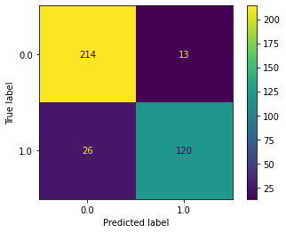
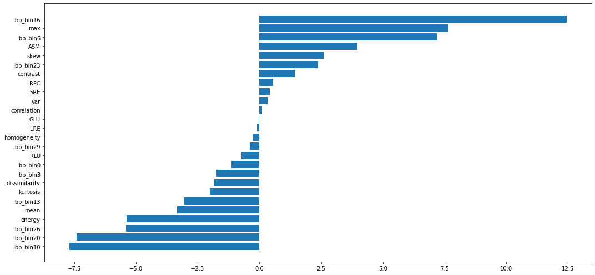

# Project 4 –  Classification of white matter lesions in lupus

# Presentation

This project originated in the context of the activities of the course Science and Data Visualization in Health, offered in the first semester of 2022, at Unicamp.

| Name                    | RA     | Specialization |
| :---:                   | :---:  |  :---:         |
| Alexandre Dias Negretti | 233609 | Computing      |
| Daniel Godoy Marques    | 166213 | Computing      |
| Gyovana Mayara Moriyama | 216190 | Computing      |

# Contextualization of the Proposal

The objective of this project is, given resonance images of ischemic and demyelinating lesions in the brain white matter, train a classifier that learns how to differentiate this lesions. So, using this trained classifier we need to answer the following question:

Lupus white matter lesions etiology are more similar to demyelinating or ischemic lesions?

# Tools
*  Numpy
*  Pandas 
*  Cv2
*  Matplotlib
*  Pillow
*  Scipy
*  glrlm
*  Scikit-Image
*  Scikit-Learn

# Pre-processing and data usage

> Descreva o pipeline de pré-processamento dos dados:
* normalização (se houver)
* outros processamentos
* uso das máscaras (se houver)
* extração de atributos (se houver)
* seleção de atributos (se houver)
> Justificar as escolhas

###  Min Max Normalization on raw images:

As for normalization, we were between the Median Mad without intensity transformation, since by the tests performed, it was the one that presented the best result (it enhanced the lesion but without taking away the characteristics of the original image) and the Min Max without intensity transformation, which also presented similar results. However, we chose to use Min Max since as we have more than 50% of the pixels of the same value, the MAD becomes zero, causing the Median Mad to return nan or inf, making it impossible to use it in several images. The choice was made both by observing the image and the histogram, since in it we can see that there is a greater quantity/importance in the lighter levels.

Tests performed with other combinations of intensity transformation and normalization did not show satisfactory results, since most of the image characteristics were lost or the lesion region was lost, which is not good for our problem.

### Mask application:

We made some tests with and without using masks on images and we observed that the model performed better with the mask. Also, on extracting attributes from images we noticed that cropping to the mask region the attributes are more specific to the lesion, not the hole white matter, so the extracted attributes are more meaninful to our problem.

### Dataset creation:

#### Label and id creation:

To create our dataframe, first we extracted the patient id from each image, so that we can split the data not having the same patient on training and validation at the same time.

Also, we create the labels for each image, being that:
* Ischemic -> 1
* Demyelinating -> 0

#### Feature extraction:

* Features extracted from histogram: we extracted attributes from the image histogram, as it is not usually used as an attribute itself. For this attributes, we got the ones that we thought that were the most explanatory for our images. 
  * Max value of the image
  * Mean value of the image
  * Variance value of the image
  * Skewness value of the image
  * Kurtosis value of the image

* Features extracted from GLCM: we used distance = 1 and angle = 0 as it is the most common. For the attributes used, we got the properties that can be extracted from the GLCM, as:
  * Contrast
  * Dissimilarity
  * Homogeneity
  * ASM
  * Energy
  * Correlation
  
* Features extracted rom GLRLM: we used level = 8. For the attributes used, we got the properties that the glrlm method returns:
  * Short Run Emphasis
  * Long Run Emphasis
  * Grey Level Uniformity
  * Run Length Uniformity
  * Run Percentage
  
* Features extracted from LBP: we used radius = 1, method = uniform and bins = 30. We chose this parameters based on tests done before, so this combination was the one that enhances the characteristics of th lesions. For the attributes, we used the histogram extracted from the LBP as features.

#### Features selection:

Here, we reduced the number of features, since most of the features generated by the LBP histogram have many zeros, leaving the matrix very sparse, so we took the columns in which the ratio of values between the sum of the column and the size of the dataset is less than 10 (threshold to not eliminate so many columns) and remove them.

# Methodology and Results
> Descreva o classificador escolhido e o pipeline de treinamento:
* split dos dados de treinamento
* escolha de parâmetros do classificador
* validação cruzada
* métricas de avaliação
* resultados do treinamento do classificador usando tabelas e gráficos
>
> Justificar as escolhas.
> Esta parte do relatório pode ser copiada da Atividade 11, caso o grupo opte por usar o SVM já treinado.
> Esta seção deve apresentar o resultado de predição das lesões de LES usando o classificador treinado. Também deve tentar explicar quais os atributos relevantes usados na classificação obtida
> * apresente os resultados de forma quantitativa e qualitativa
> * tenha em mente que quem irá ler o relatório é uma equipe multidisciplinar. Descreva questões técnicas, mas também a intuição por trás delas.

After normalizing the images, we applied a method called Grid Search. This method trains the model using a range of different parameters that control the learning process, called hyperparameters, and chooses the best set of hyperparameters based on the accurracy of the model using those hyperparameters. Therefore, we achieved an accurracy of 0.89.

After choosing the best model, we were able to elect the most important features for this model. The importance is defined by how much information this features bought during the learning phase.

In the graph above are shown the most important features; both high positive and negative values indicate the importance of the feature to help the model converge. Therefore, from all 26 most importante features, 10 are LBP features, which means a high contribution to the model of features that describes the pattern texture of the image, which may imply that the brain lesions has a characteristic texture that differ ischemic (AVC) lesions from demyelinating (EM) lesions.

# Conclusion
> Destacar as principais conclusões obtidas no desenvolvimento do projeto.
>
> Destacar os principais desafios enfrentados.
>
> Principais lições aprendidas.

Working with images has its differences and similarities compared to working with structured data. It's important to understand how to extract features from the image that didn't seen so obvious than extracting features from structured. For example, a histogram of an image by itself does not have much information, but features extracted from the histogram are way more useful.

Same as structured data, image data also must be cleaned and normalized, but with different methods. When using masks, it's important to check if the mask has only 0 and 1 values and if the size of the mask is adequate to its corresponding image. There are plenty of methods of normalization for images, and each one of them is more suitable for one kind of image. For example, we wanted to use MAD normalization, but this method is not compatible with images that have a majority of zeros.

Finally, it's curious to notice that the lesions are very similar to each other by just beholding it, but even though it's possible to build a models to learn it's differences and particularities

## Future Work
> * o que poderia ser melhorado se houvesse mais tempo?
We'd like to use Neural Network and Deep Learning in this work. It's widely used with image processing and AI Health Analisys. It would be interesting because it's a completely different method from ours and also could bring good results. Since we were concerned with the time needed to use learn, implement and test it, we decided to stick to SVM and finish the work only using the model we developed prior.
